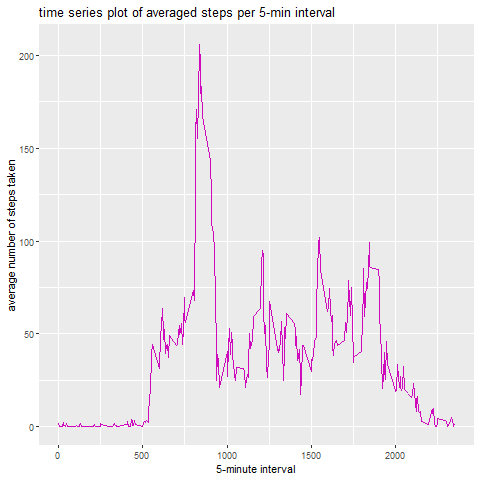

PA1\_template
================

## Coursera: Reproducible Research Assignment 1

### Preparation for the Assignment

The packages used are:

``` r
library(dplyr)
```

    ## 
    ## Attaching package: 'dplyr'

    ## The following objects are masked from 'package:stats':
    ## 
    ##     filter, lag

    ## The following objects are masked from 'package:base':
    ## 
    ##     intersect, setdiff, setequal, union

``` r
library(ggplot2)
```

Reading in the data and processing it

``` r
activity <- read.csv("activity.csv")
str(activity)
```

    ## 'data.frame':    17568 obs. of  3 variables:
    ##  $ steps   : int  NA NA NA NA NA NA NA NA NA NA ...
    ##  $ date    : chr  "2012-10-01" "2012-10-01" "2012-10-01" "2012-10-01" ...
    ##  $ interval: int  0 5 10 15 20 25 30 35 40 45 ...

``` r
activity$date <- as.POSIXct(activity$date, format = "%Y- %m -%d")
activity$steps <- as.double(activity$steps)
head(activity)
```

    ##   steps       date interval
    ## 1    NA 2012-10-01        0
    ## 2    NA 2012-10-01        5
    ## 3    NA 2012-10-01       10
    ## 4    NA 2012-10-01       15
    ## 5    NA 2012-10-01       20
    ## 6    NA 2012-10-01       25

We transformed the steps to double due to replacing the missing values
by their mean later on.

### Task1: What is mean total number of steps taken per day?

Preparing the data and use `na.rm = TRUE` to ignore missing values.

``` r
task1 <- activity %>%
    group_by(date) %>%
    summarise(steps = sum(steps, na.rm = TRUE))
head(task1)
```

    ## # A tibble: 6 x 2
    ##   date                steps
    ##   <dttm>              <dbl>
    ## 1 2012-10-01 00:00:00     0
    ## 2 2012-10-02 00:00:00   126
    ## 3 2012-10-03 00:00:00 11352
    ## 4 2012-10-04 00:00:00 12116
    ## 5 2012-10-05 00:00:00 13294
    ## 6 2012-10-06 00:00:00 15420

Make the plot with base R:

``` r
png(filename="histogram1.png", width=480,height=480)
hist(
    task1$steps,
    xlab = "Number of steps taken per day",
    xlim = c(0, max(task1$steps)),
    breaks = nrow(task1),
    main = "Distribution of number of steps taken per day",
    col = "turquoise3"
)
box()
dev.off ()
```

    ## png 
    ##   2


Calculate and save the mean and the median:

``` r
mean_task1 <- mean(task1$steps)
mean_task1
```

    ## [1] 9354.23

``` r
median_task1 <- median(task1$steps)
median_task1
```

    ## [1] 10395

So the mean is 9354.23 and the median is 1.0395^{4}.

### Task2: What is the average daily activity pattern?

Preparing the data for the time series plot:

``` r
task2 <- activity %>%
    group_by(interval) %>%
    summarise(steps = mean(steps, na.rm = TRUE))
head(task2)
```

    ## # A tibble: 6 x 2
    ##   interval  steps
    ##      <int>  <dbl>
    ## 1        0 1.72  
    ## 2        5 0.340 
    ## 3       10 0.132 
    ## 4       15 0.151 
    ## 5       20 0.0755
    ## 6       25 2.09

Make the plot with ggplot2:

``` r
png(filename="timeseries1.png", width=480,height=480)
ggplot(data = task2, aes(x = interval, y = steps)) +
    geom_line(color = 6, size = 0.5) +
    xlab("5-minute interval") +
    ylab("average number of steps taken")+
    labs(title = "time series plot of averaged steps per 5-min interval",
         color = "types")
dev.off ()
```

    ## png 
    ##   2



Calculating the 5-minute interval that, on average across all the days
in the dataset, contains the maximum number of steps

``` r
interval_max_steps <- which.max(task2$interval)
interval_max_steps
```

    ## [1] 288

So the interval we searched for is interval 288.

### Task3: Imputing missing values

The number of rows with missing values can be calculated by

``` r
na_rows <- nrow(activity %>% filter(is.na(steps)))
na_rows
```

    ## [1] 2304

The method we are going to use to impute the missing values is by
replacing them by the mean of the corresponding 5-minute interval.

``` r
activity_noan <-
    left_join(activity,
              task2 %>% rename(steps_mean = steps),
              by = c("interval" = "interval")) %>%
    mutate(steps = case_when(is.na(steps) ~ steps_mean, TRUE ~ steps)) %>% 
    select(-steps_mean)
head(activity_noan)
```

    ##       steps       date interval
    ## 1 1.7169811 2012-10-01        0
    ## 2 0.3396226 2012-10-01        5
    ## 3 0.1320755 2012-10-01       10
    ## 4 0.1509434 2012-10-01       15
    ## 5 0.0754717 2012-10-01       20
    ## 6 2.0943396 2012-10-01       25

For the new histogram the data is processed

``` r
task1_noan <- activity_noan %>%
    group_by(date) %>%
    summarise(steps = sum(steps, na.rm = TRUE))
head(task1_noan)
```

    ## # A tibble: 6 x 2
    ##   date                 steps
    ##   <dttm>               <dbl>
    ## 1 2012-10-01 00:00:00 10766.
    ## 2 2012-10-02 00:00:00   126 
    ## 3 2012-10-03 00:00:00 11352 
    ## 4 2012-10-04 00:00:00 12116 
    ## 5 2012-10-05 00:00:00 13294 
    ## 6 2012-10-06 00:00:00 15420

And then the plot is made by the code

``` r
png(filename="histogram2.png", width=480,height=480)
hist(
    task1_noan$steps,
    xlab = "Number of steps taken per day/no NAs",
    xlim = c(0, max(task1_noan$steps)),
    breaks = nrow(task1_noan),
    main = "Distribution of number of steps taken per day",
    col = "turquoise3"
)
box()
dev.off ()
```

    ## png 
    ##   2


The new mean and median are

``` r
mean_task1_noan <- mean(task1_noan$steps)
mean_task1_noan
```

    ## [1] 10766.19

``` r
median_task1_noan <- median(task1_noan$steps)
median_task1_noan
```

    ## [1] 10766.19

The mean with missing values which we computed in Task 1 was 9354.23 and
the median was 1.0395^{4}. We now have 1.076619^{4} as the mean and
1.076619^{4} as the median when the missing values are replaced by their
corresponding mean. Before the `NA`s were replaced they were counted as
being 0 (by `na.rm = TRUE`). You can see in the histogram that the
frequency of no-step-days is much lower than before imputing missing
values. Mean and median are higher now.

### Task 4: Are there differences in activity patterns between weekdays and weekends?

We again prepare the data for the next analysis by adding a factor
variable which tells us if a day was a weekday or not

``` r
task4 <- activity_noan %>%
    mutate(dtype = as.factor(case_when(
        weekdays(date) %in% c("Samstag", "Sonntag") ~ "weekend",
        TRUE ~ "weekday"
    )))  
head(task4)
```

    ##       steps       date interval   dtype
    ## 1 1.7169811 2012-10-01        0 weekday
    ## 2 0.3396226 2012-10-01        5 weekday
    ## 3 0.1320755 2012-10-01       10 weekday
    ## 4 0.1509434 2012-10-01       15 weekday
    ## 5 0.0754717 2012-10-01       20 weekday
    ## 6 2.0943396 2012-10-01       25 weekday

After adding the new variable we calculate the mean for each 5-minute
interval and each daytype

``` r
task4_plot <- task4 %>%
    group_by(dtype, interval) %>%
    summarise_at(vars(steps), funs(mean(.,na.rm =TRUE)))
```

    ## Warning: `funs()` is deprecated as of dplyr 0.8.0.
    ## Please use a list of either functions or lambdas: 
    ## 
    ##   # Simple named list: 
    ##   list(mean = mean, median = median)
    ## 
    ##   # Auto named with `tibble::lst()`: 
    ##   tibble::lst(mean, median)
    ## 
    ##   # Using lambdas
    ##   list(~ mean(., trim = .2), ~ median(., na.rm = TRUE))
    ## This warning is displayed once every 8 hours.
    ## Call `lifecycle::last_warnings()` to see where this warning was generated.

``` r
head(task4_plot)
```

    ## # A tibble: 6 x 3
    ## # Groups:   dtype [1]
    ##   dtype   interval  steps
    ##   <fct>      <int>  <dbl>
    ## 1 weekday        0 2.25  
    ## 2 weekday        5 0.445 
    ## 3 weekday       10 0.173 
    ## 4 weekday       15 0.198 
    ## 5 weekday       20 0.0990
    ## 6 weekday       25 1.59

The result is

``` r
png(filename="timeseries2.png", width=480,height=480)
ggplot(data = task4_plot, aes(x = interval, y = steps, color = dtype)) +
    geom_line(size = 0.5) +
    facet_wrap(~dtype ,ncol = 1, nrow = 2)+
    xlab("5-minute interval") +
    ylab("average number of steps taken")+
    labs(title = "time series plots of averaged steps per 5-min interval",
         color = "types")
dev.off ()
```

    ## png 
    ##   2


